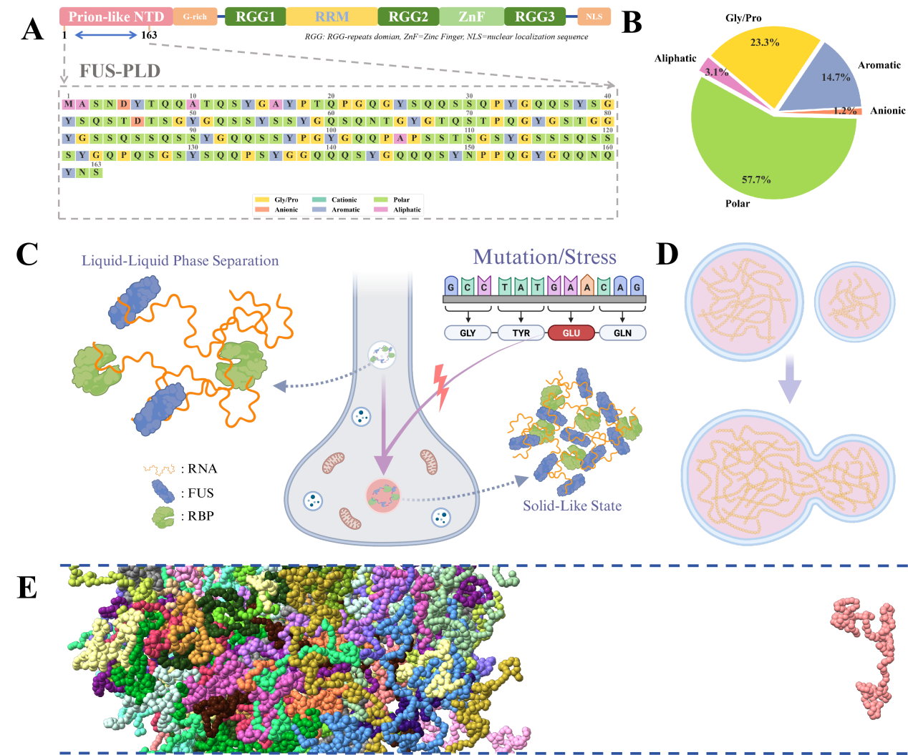
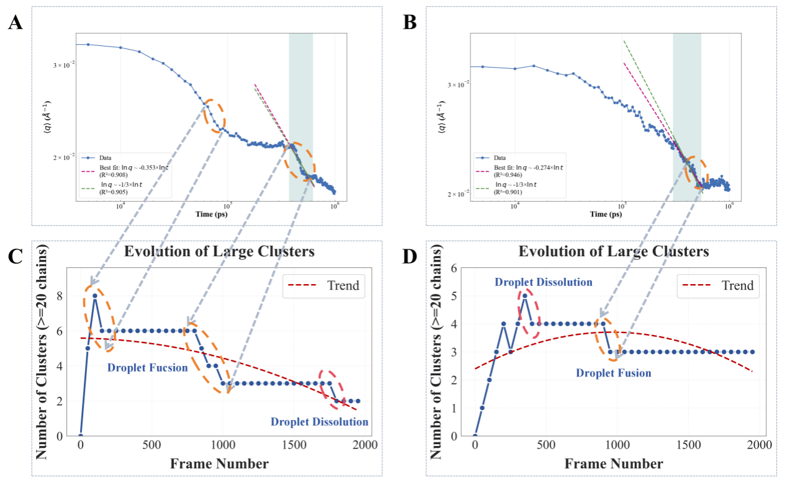

# Coarse-Grained Molecular Dynamics Study of Liquid-Liquid Phase Separation in FUS Intrinsically Disordered Protein

## Research Background

Protein liquid-liquid phase separation (LLPS) is a crucial biophysical process in cells, playing key roles in various biological functions. The FUS protein (Fused in Sarcoma) is a multifunctional RNA-binding protein, with its N-terminal prion-like domain (PLD, amino acids 1-163) exhibiting typical intrinsically disordered characteristics and serving as the critical region for FUS protein liquid-liquid phase separation.

The LLPS process of FUS protein is closely associated with neurodegenerative diseases such as amyotrophic lateral sclerosis (ALS). Under normal physiological conditions, FUS protein can form membrane-less organelles through reversible LLPS to participate in RNA metabolism and other processes; however, when pathogenic mutations occur (such as G153E), this dynamic reversible phase separation may transform into irreversible solid-liquid phase separation, leading to abnormal protein aggregation in neurons and triggering neurodegenerative changes.

Although experimental techniques such as protein photobleaching, nuclear magnetic resonance, and in vitro cell experiments provide important methods for studying LLPS, these approaches have limited resolution in terms of temporal and spatial scales, making it difficult to reveal the molecular mechanisms during phase separation. Molecular simulation methods offer an effective approach to address this limitation, enabling the prediction of protein behavior under different conditions from a microscopic perspective and revealing structural changes and dynamic characteristics during the phase separation process.

## Research Methods

This study employs multi-scale computational methods to investigate the liquid-liquid phase separation process of FUS-PLD:

1. **All-atom and coarse-grained force field benchmark testing**:
   - Using AlphaFold for preliminary 3D conformation modeling of FUS-PLD
   - Conducting simulations with CHARMM-36m, Amber ff99SB, and AMBER-99SB-DISP all-atom force fields
   - Comparing with CALVADOS and Mpipi-Recharged coarse-grained models
   - Calculating parameters such as radius of gyration (Rg) and end-to-end distance (REE) to evaluate force field performance
2. **Coarse-grained model construction and phase diagram plotting**:
   - Using the CALVADOS implicit solvent model to construct the FUS-PLD phase separation system
   - Setting different temperature gradients (280K-305K) and building phase separation simulation boxes
   - Calculating density distributions of condensed and dilute phases using Gaussian kernel density estimation
   - Drawing phase diagrams based on Flory-Huggins theory and determining the critical temperature
3. **Quench simulation**:
   - Designing two cooling paths: 350K→280K (high supercooling) and 350K→310K (low supercooling)
   - Analyzing contact interaction networks, cluster growth, and structure factors
   - Applying Ostwald ripening theory and physical models to analyze droplet growth dynamics
4. **Droplet fusion dynamics study**:
   - Analyzing morphological evolution of droplet fusion and dissolution
   - Calculating changes in structure factors over time and the number of clusters with more than 20 chains
   - Analyzing dynamic differences in droplet fusion and dissolution under different supercooling conditions

## Main Research Findings

1. **All-atom and coarse-grained force field comparative validation**:
   - Coarse-grained models (CALVADOS and Mpipi-Recharged) outperform all-atom models in conformational sampling
   - All-atom models show that FUS-PLD tends to behave like a structured protein rather than exhibiting the expected intrinsically disordered protein behavior
   - Coarse-grained models better simulate the conformational ensemble of intrinsically disordered proteins
2. **FUS-PLD phase diagram plotting**:
   - Under the CALVADOS model, the critical temperature of FUS-PLD is determined to be approximately 313.12K, close to physiological temperature
   - A complete concentration-temperature phase diagram was drawn, providing a foundation for understanding FUS protein phase separation behavior
3. **Droplet formation dynamics study**:
   - Discovery that supercooling degree is a key factor determining droplet formation rate
   - Droplet growth undergoes two stages: an early stage dominated by cluster fusion and a later stage limited by diffusion
   - Polar residues (GLN, ASN, ASP) and flexible residues (GLY) show significant contact preferences during cluster formation
4. **Droplet fusion dynamics study**:
   - Under high supercooling conditions (280K), droplet fusion exhibits typical power-law growth (exponent approximately 1/3)
   - Under low supercooling conditions (310K), droplets tend to dissolve
   - The fusion process time scale is much shorter than the dissolution process, reflecting differences in energy barriers between different phase transition pathways
5. **Development of analysis toolkit**:
   - Development of the CGAnalysis software package, specifically designed for processing trajectory data from coarse-grained models like CALVADOS
   - Implementation of high-performance parallel computing and modular architecture, supporting multiple analysis tasks such as cluster size distribution and interaction heat maps

## Conclusions and Future Perspectives

This study explores the liquid-liquid phase separation mechanism of FUS-PLD in depth through multi-scale molecular simulations, revealing the physical details of droplet formation, fusion, and dissolution processes. The main conclusions include:

1. In simulating the liquid phase separation process of intrinsically disordered proteins, coarse-grained models demonstrate better conformational sampling capabilities compared to all-atom models
2. The critical temperature of FUS-PLD is close to physiological temperature, indicating that its phase separation behavior is highly sensitive to environmental conditions
3. The droplet formation process exhibits a two-stage growth mechanism: initially dominated by cluster fusion, later transitioning to diffusion-limited Ostwald ripening
4. Polar and flexible residues play a dominant role in cluster formation, and this residue interaction specificity provides a molecular basis for understanding the dynamic characteristics of FUS protein droplets
5. Droplets exhibit different dynamic behaviors under high and low supercooling conditions, which may be related to how biological systems regulate the formation and dissolution of protein condensates

Future research directions include:

- Further exploration of the formation dynamics of networks within high-density regions
- Refinement of benchmark testing systems for all-atom and coarse-grained force fields
- Investigation of the effects of core pathogenic mutations (such as G156E) on the phase behavior of FUS protein
- Combination with experimental techniques to validate simulation predictions and construct phase separation pathogenic mechanism models with greater biomedical significance

These studies not only deepen the understanding of protein phase transition physical mechanisms but also provide a theoretical basis for early diagnosis and treatment strategy development for neurodegenerative diseases such as ALS.