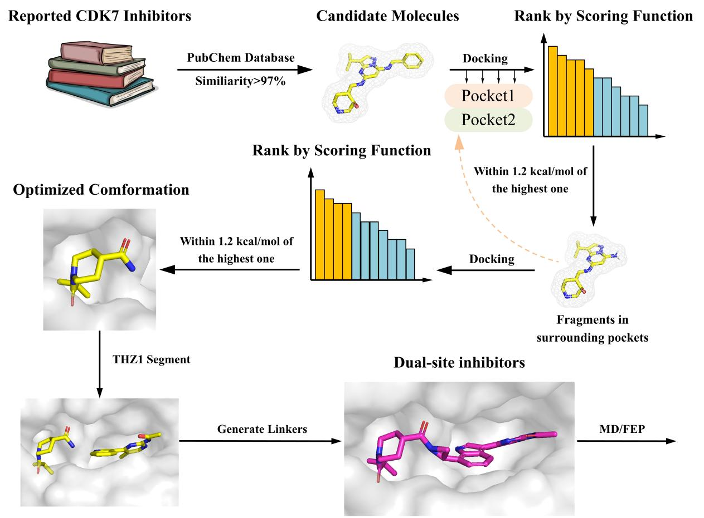
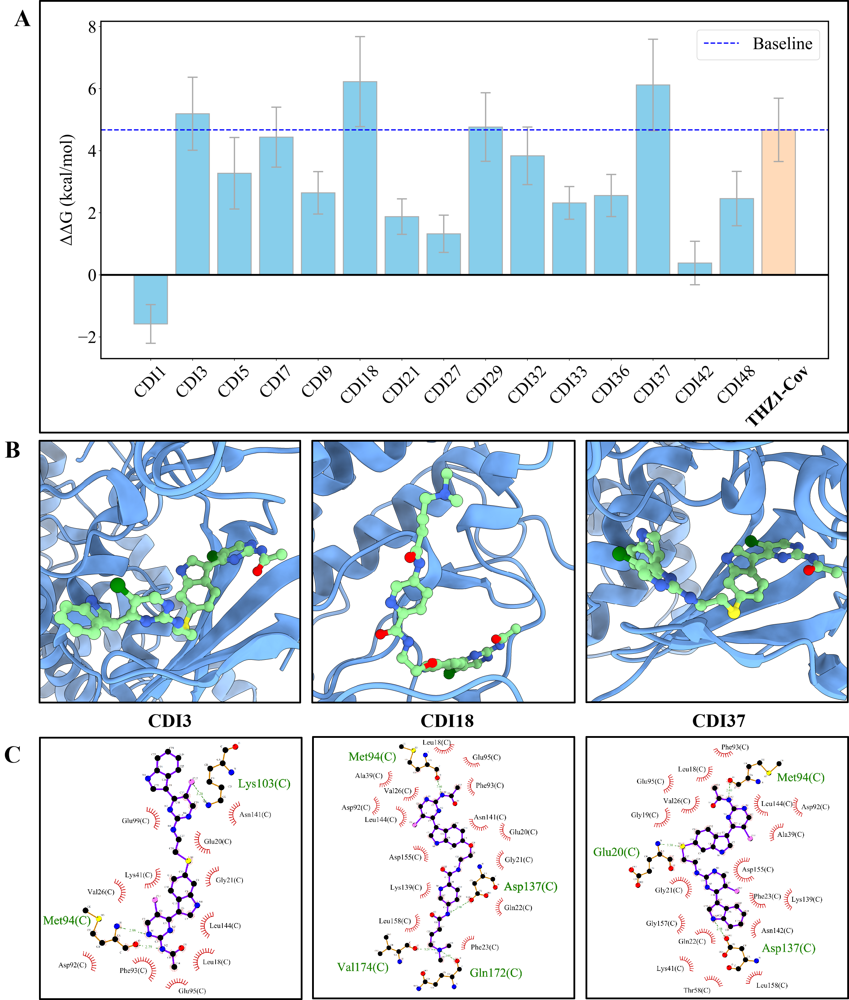

# Computational Framework for CDK7 Inhibitor Optimization in Cancer Therapy

This document presents a research paper focused on developing non-covalent CDK7 inhibitors for cancer treatment through computational methods. The research was conducted by Zhaoqi Shi, Xufan Gao, Damiano Buratto, and Ruhong Zhou from Zhejiang University and Columbia University.

## Background

- CDK7 (Cyclin-dependent kinase 7) plays critical roles in cell cycle regulation and transcription
- CDK7 is overexpressed in various cancers, making it a promising therapeutic target
- Current covalent inhibitors like THZ1 have limitations including short half-life and off-target effects

## Methodology

The researchers employed a comprehensive computational approach:

1. Virtual screening to identify potential inhibitor fragments
2. Molecular dynamics simulations to understand binding mechanisms
3. Free energy perturbation (FEP) to quantify binding affinities

## Key Findings

- Identified the core segment of THZ1 (THZ1-Segment2) that stably binds to CDK7
- Designed 46 candidate inhibitors by combining this core segment with fragments from known inhibitors
- Identified three promising non-covalent inhibitors (CDI3, CDI18, CDI37) with binding affinities comparable to or better than THZ1

## Significance

This work provides:

- Safer alternatives to covalent CDK7 inhibitors with potentially fewer side effects
- A versatile computational framework for drug discovery
- Valuable insights for developing kinase-targeted cancer therapies

 *Figure. 2* Roadmap of design

 *Figure 5: Relative binding free energy and interaction profiles of the designed CDK7 inhibitors. The bar chart shows binding affinities of different inhibitors compared to THZ1, with CDI3, CDI18, and CDI37 showing the strongest binding. The molecular diagrams illustrate how these compounds interact with CDK7.*