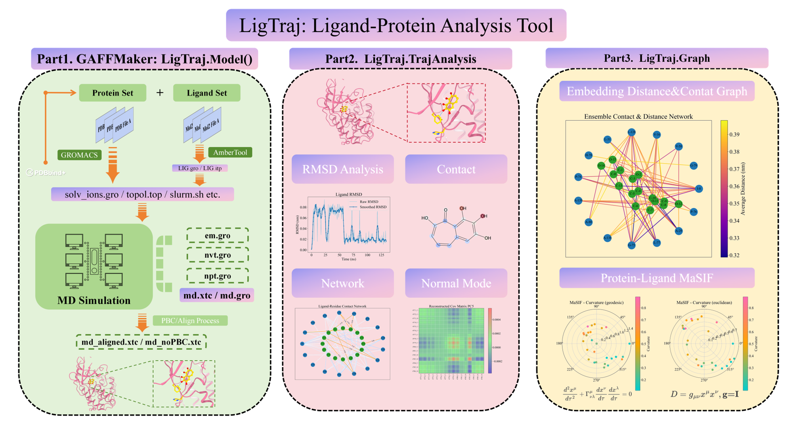

# LigTraj & GAFFMaker: Leveraging MD Trajectories for Small Molecule AI

## Project Overview

LigTraj and GAFFMaker represent a comprehensive toolkit designed to bridge molecular dynamics (MD) simulations with modern machine learning approaches for small molecule discovery and optimization. This suite of tools streamlines the entire workflow from simulation setup to feature extraction for AI-based models, complemented by the LigTraj.org database for standardized trajectory data.



## LigTraj.org Database

The LigTraj.org database serves as a centralized repository of protein-ligand molecular dynamics trajectories, designed to complement the analytical capabilities of the LigTraj toolkit. This growing database addresses a critical gap in the field by providing:

- **Standardized Trajectory Data**: Curated collection of protein-ligand MD trajectories with consistent formats and protocols
- **Diverse Protein Targets**: Coverage across major protein families and therapeutic targets
- **Validated Ligand Sets**: Including known drugs, clinical candidates, and reference compounds
- **Rich Metadata**: Binding affinity data, experimental conditions, and computational parameters
- **Quality Control Metrics**: Assessments of simulation stability, convergence, and reliability

Researchers can directly query LigTraj.org to access pre-computed trajectories, avoiding the computational expense of running new simulations for common protein-ligand systems. The database is specifically structured to facilitate machine learning applications:

- Ready-to-use training datasets for binding affinity prediction models
- Benchmark systems for testing new computational methods
- Reference data for transfer learning applications
- Comparative analysis across multiple ligands for the same target

The integration between LigTraj tools and the LigTraj.org database provides a seamless workflow where researchers can either generate new trajectory data using GAFFMaker or leverage existing data from the database, then process it through LigTraj's analysis pipeline for ML feature extraction.

### LigTraj

LigTraj processes and analyzes molecular dynamics trajectories, extracting meaningful features for downstream machine learning applications:

- **Traditional Analysis**: RMSD profiles, contact maps, covariance matrices
- **Graph Representations**: Contact networks, ensemble graphs compatible with GNNs
- **Advanced Embeddings**: MaSIF-style surface embeddings, geodesic mappings, and conformational landscapes

These analyses provide rich, physics-based features that capture the dynamics of protein-ligand interactions in ways static structures cannot. LigTraj is fully compatible with trajectories sourced from the LigTraj.org database, enabling researchers to immediately apply advanced analysis to curated data.

## Machine Learning Applications

The extracted features and embeddings are specifically designed to serve as input for various machine learning and deep learning models:

- **Binding Affinity Prediction**: Using contact patterns and conformational ensembles to predict binding energies
- **Pharmacophore Modeling**: Leveraging dynamic interaction patterns rather than static structures
- **Generative Models**: Training molecule generators that account for conformational flexibility
- **De Novo Design**: Guiding the design of novel compounds with desirable interaction profiles

By capturing the dynamic nature of protein-ligand interactions, these features provide more realistic representations than traditional static molecular descriptors.

## Technical Implementation

The toolkit is implemented in Python with a focus on compatibility with popular machine learning frameworks:

- Graph representations compatible with PyTorch Geometric
- Embeddings suitable for standard ML/DL libraries (PyTorch, TensorFlow, scikit-learn)
- Efficient data processing using NumPy, pandas, and MDTraj
- Visualization capabilities through matplotlib and RDKit

## Getting Started

Researchers can easily incorporate these tools into their drug discovery pipelines:

```bash
# Install the package
git clone https://github.com/aib001/LigTraj.git
cd LigTraj
pip install -e .

# Run simulations using GAFFMaker
bash GAFFMaker.sh <structure_input_directory/> <simulation_output_directory/> <queue_name> <run_time>

# Analyze trajectories and extract ML features
python -c "
from LigTraj import TrajAnalysis, Graph
TrajAnalysis.rmsd('topology.gro', 'trajectory.xtc')
Graph.build('topology.gro', 'trajectory.xtc', 'ligand.sdf')
Graph.feature('topology.gro', 'trajectory.xtc', 'ligand.sdf')
"

# Alternatively, access pre-computed trajectories from LigTraj.org
python -c "
from LigTraj import Database
# Download trajectory for a specific protein-ligand pair
Database.fetch('CDK2', 'compound_id_123')
"
```

## Future Directions

This toolkit represents an emerging paradigm in computer-aided drug design where dynamic simulations inform machine learning models. Future developments will focus on:

- Integration with advanced deep learning architectures (transformers, diffusion models)
- Enhanced sampling techniques to improve feature quality
- Expansion of the LigTraj.org database to cover more protein families and compound classes
- Development of standardized benchmarks for trajectory-based machine learning models
- Automated feature selection for specific prediction tasks
- Community-driven contributions to the trajectory database

By combining the physics-based insights from molecular dynamics with the predictive power of modern AI, this approach aims to address the limitations of traditional virtual screening methods and accelerate small molecule discovery and optimization. The growing [LigTraj.org](http://ligtraj.org) database will serve as a valuable resource for the computational chemistry and drug discovery communities, providing high-quality data for training next-generation AI models.